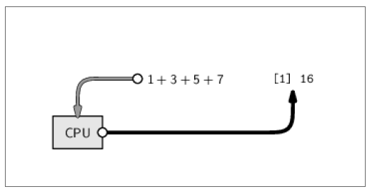

```{r setup, include=FALSE}
knitr::opts_chunk$set(echo = FALSE)
```

# Premissas: por que programar?


Para a maioria dos usuários, a interação com o computador se limita a clicar em links, selecionar menus e caixas de diálogo, na maioria das vezs sem ler nada do que aparece na tela

{width=180px}

# Premissas: por que programar?


- O problema com esse comportamento é que parece que o usuário é controlado pelo computador

<br>

- A verdade deveria ser o oposto!

<br>

- É o usuário que possui o controle e deve dizer para o computador exatamente o que fazer


# Premissas: por que programar?


> Aprender a interagir com o computador através de uma linguagem de programação, coloca o usuário na sua posição original de poder!


# O que é R?


R é uma linguagem e também um ambiente de desenvolvimento integrado para cálculos estatísticos e gráficos... Porém, ele é capaz de fazer milhões de outras coisas!

# O que é R?


Foi criado originalmente por **R**oss Ihaka e por **R**obert Gentleman no departamento de Estatística da Universidade de Auckland, Nova Zelândia. Posteriormente, foi desenvolvido pelo esforço colaborativo de pessoas em vários locais do mundo

# O que é RStudio?

- O RStudio é uma *GUI*.

- Acrônimo GUI do inglês *Graphical User Interface* ou *interface gráfica do usuário*  


# Por que R?

- Acessível a não programadores!

- Livre, aberta, gratuita!

- Gráficos espetaculares!

- Comunidade imensa + milhares de pacotes!

# Paradigma do R

> "Tudo o que existe no R é um objeto"
"Tudo o que acontece no R é o chamado de uma função"

# Como pedir ajuda **fora do R**? 

 

# Como pedir ajuda? 

No R, há cinco principais maneiras de pedir ajuda:

1. Help/documentação do R. Ex.: "help(função)" ou "?função"

2. Google: "R minha_duvida"

3. [Stack Overflow](https://stackoverflow.com/) - [Stack Overflow em pt/br](https://pt.stackoverflow.com/)

4. A/O colega **mais** nerd ao lado

5. Grupo R Brasil no Telegram - [t.me/rbrasiloficial](https://t.me/joinchat/rbrasiloficial)

> A busca por ajuda é feita preferencialmente, mas não necessariamente, na ordem acima. Vá no que for mais rápido

# Rstudio


# Rstudio

- **Editor/Scripts**: é onde escrevemos nossos códigos.
- **Console***: é onde rodamos o código e recebemos as saídas. O R vive aqui!
- ***Environment***: painel com todos os objetos criados na sessão.
- ***Files***: mostra os arquivos no diretório de trabalho. É possível navegar entre diretórios.
- ***Plots***: painel onde os gráficos serão apresentados.
- ***Help***: janela onde a documentação das funções serão apresentadas.
- ***History**: painel com um histórico dos comandos rodados.


# Rstudio: atalhos

- **CTRL+ENTER**: roda a linha selecionada no script. Os atalhos mais utilizado.
- ***ALT+-***: (<-) sinal de atribuição. Você usará o tempo todo.
- ***CTRL+SHIFT+M***: (%>%) operador pipe. Guarde esse atalho, você usará bastante.
- ***CTRL+1***: altera cursor para o script.
- ***CTRL+2***: altera cursor para o console.
- ***CTRL+ALT+I***: cria um chunk no R Markdown.
- ***ALT+SHIFT+K**: janela com todos os atalhos disponíveis.

# Dicas de sobrevivência

O diretório de trabalho (em inglês *W*orking *D*irectory ou *WD*) é a pasta no computador onde o R vai guardar todos os arquivos (base de dados, gráficos, imagens geradas).


# Dicas de sobrevivência

O símbolo *>* indica que o R está pronto para receber um comando:

```{r, echo=TRUE}
2+2
```

O símbolo *>* muda para *+* se o comando estiver incompleto:


>2*


*+* 

# Dicas de sobrevivência

Espaços entre os números não fazem diferença:

```{r, echo=TRUE}
2+            2
```

# Dicas de sobrevivência

**O R é "case sensitive": diferencia maiúsculas de minúsculas**


\center
Nome **não é igual a** nome


f **não é igual a** F 


# Dicas de sobrevivência

Para executar um código a partir do script no RStudio, selecione **a linha desejada ou o trecho/objeto** e aperte o botão "RUN" ou CTRL+R ou CTRL+ENTER


# Dicas de sobrevivência

**Toda função deve ser executada com uso de parênteses**
\center
mean(2,3)


Os valores dentro dos parênteses são chamados argumentos. São os inputs necessários para a operação ser executada.


*NÃO* há espaço entre os parênteses e o nome da função

# Dicas de sobrevivência: onde ficam salvos os resultados?

```{r, echo=TRUE}
1 + 3 + 5 + 7
```


# Dicas de sobrevivência: onde ficam salvos os resultados?

Note que o resultado é apenas mostrado na tela, nada é salvo na memória
(*por enquanto*)



# O editor de scripts


- Para criar rotinas computacionais é necessário utilizar um editor de scripts

- Clique em File > New file > R script 

- O arquvo dve ser salvo com a extensão *.R*

# Comentando scripts

- Para adicionar comentários ao script, utiliza-se o símbolo # antes do texto e/ou comandos. O que estiver depois do
símbolo não será interpretado pelo R. 
Portanto:


2 + 2 # esta linha será executada

# 2 + 2 esta linha não será executada


# Criando objetos do R ou “salvando”os resultados


# Criando objetos do R ou “salvando”os resultados


- Estas variáveis ficam armazenadas no chamado workspace do R

- O workspace consiste de tudo que foi criado durante uma sessão do R, armazenado na memória RAM

- Para efetivamente salvar esas variáveis, podemos armazenar esse workspace do R em disco, em um arquivo chamado
.Rdata

# Criando objetos do R ou “salvando”os resultados

{width=180px}

# Criando objetos do R ou “salvando”os resultados


- Existem várias maneiras de atribuir um valor a uma variável e, novamente, isso não depende do tipo de valor que está sendo atribuído.

- Os operadores de atribuição válidos são **<-** e **=**, sendo o primeiro preferido.

- Ao contrário de outras linguagens de programação você não precisa definir o tipo de variável criada!

# Prática: criando meu primeiro objeto no R

x <- 1 (use a tecla de atalho **ALT MAIS A TECLA -**)

(ao criar o objeto note no campo enviroment que ele vai aparecer lá)--------->


# Tipos de objetos atômicos no R

- Existem cinco classes básicas ou “atômicas” no R:

- character (texto, string, character, caracteres)

- numeric (número, valor real, numeric, double)

- integer (números inteiros)

- logical (lógico, logical, booleano, valor TRUE/FALSE)


# Prática: crie cada um destes objetos no R


# Comandos básicos I

1.ls() é o comando que lista todos os objetos no ambiente do R. Não requer argumentos

2.rm(x) é o comando para deletar o elemento x do ambiente

3.rm(list=ls()) deleta todos os elementos do ambiente

4.CTRL+L limpa o terminal do RStudio

# Comandos básicos II

funcao_somar_mais_um <- function(num){ 
  return(num+1)         
}


#  Meu primeiro loop 

for (numero in 1:5){
  print (numero)
}

# Loops dentro de funções 

listadenumeros <- c(1,2,3,4,5)
for (numero in listadenumeros){
  print(numero+1)
}
